# company-website-aws
Deploying a company website on AWS — custom VPC, EC2, Apache
# Company Website Deployment on AWS

## Overview
This project demonstrates deploying a static company website on an AWS EC2 instance running Apache, built inside a custom VPC configured from scratch. All networking components were manually created to demonstrate understanding of AWS networking fundamentals.

**Live URL:** http://52.212.95.65  
**Region:** eu-west-1 (Europe - Ireland)  
**Deployed by:** Promise Edet (Mimi)

---


**Traffic flow:**  
User Browser → Internet Gateway → Route Table → Public Subnet → Security Group → EC2 Instance → Apache → index.html

---

## Resources Created

| Resource | Name | ID | Notes |
|----------|------|----|-------|
| VPC | company-web-vpc | vpc-0b7813c456aa7f91a | CIDR: 10.0.0.0/16 |
| Subnet | company-web-public-subnet | subnet-0ec3a68530b7e7e40 | CIDR: 10.0.1.0/24, AZ: eu-west-1a |
| Internet Gateway | company-web-igw | igw-067f8e3147094e7e0 | Attached to company-web-vpc |
| Route Table | company-web-public-rt | rtb-033f12169f4c27aa7 | Routes internet traffic to IGW |
| Security Group | company-web-sg | sg-0751fd88931091b09 | HTTP port 80, SSH port 22 |
| EC2 Instance | company-web-server | i-0c557f3dea28c3c16 | t2.micro, Amazon Linux 2023 |

---

## Step 1 — VPC

**What it is:** A Virtual Private Cloud is an isolated virtual network in AWS where all project resources live. It is the networking boundary for the entire deployment.

**Why not the default VPC:** Using the default VPC would skip all networking configuration. Building a custom VPC demonstrates understanding of how AWS networking is structured from the ground up.

**Configuration:**
- CIDR: `10.0.0.0/16` — private RFC 1918 range, 65,536 available addresses
- DNS resolution: Enabled
- DNS hostnames: Enabled — required so the EC2 instance receives a public DNS name
- Tenancy: Default

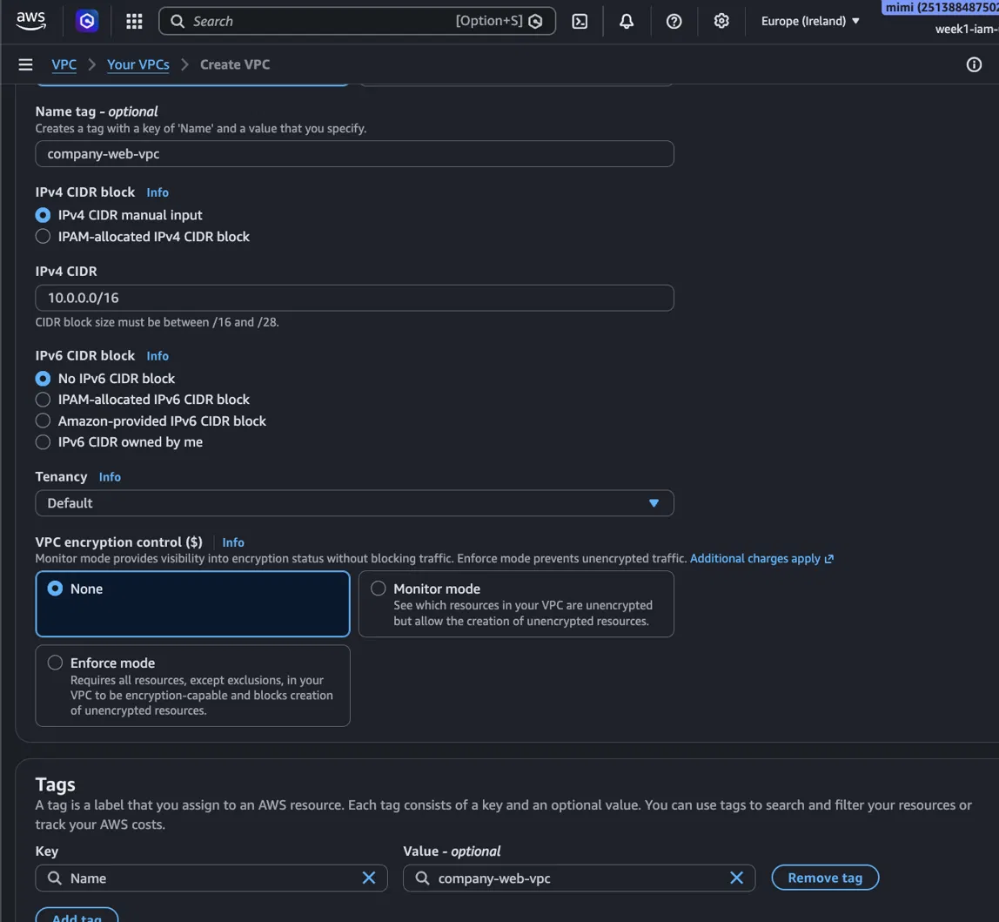
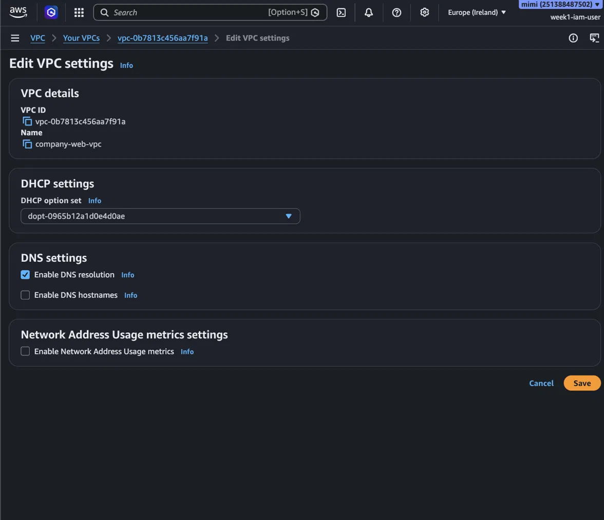
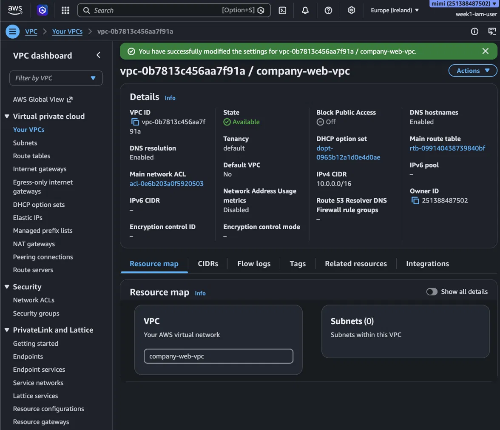

---

## Step 2 — Public Subnet

**What it is:** A subnet is a slice of the VPC's address range pinned to a single Availability Zone. Instances cannot be placed in a VPC directly — they must be placed in a subnet.

**Why /24:** The VPC owns 10.0.0.0/16. The subnet takes one /24 block (10.0.1.0/24), leaving the rest of the VPC free for future private subnets such as an app tier or database tier — a standard three-tier architecture pattern.

**Configuration:**
- CIDR: `10.0.1.0/24` — 256 addresses, 251 usable (AWS reserves 5)
- Availability Zone: eu-west-1a
- Auto-assign public IPv4: Enabled — ensures instances receive a public IP on launch

**Note:** A subnet is not public by name alone. It becomes public in Step 4 when associated with a route table that has a 0.0.0.0/0 route pointing to the internet gateway. The auto-assign setting and the route table association are two separate mechanisms, both required.

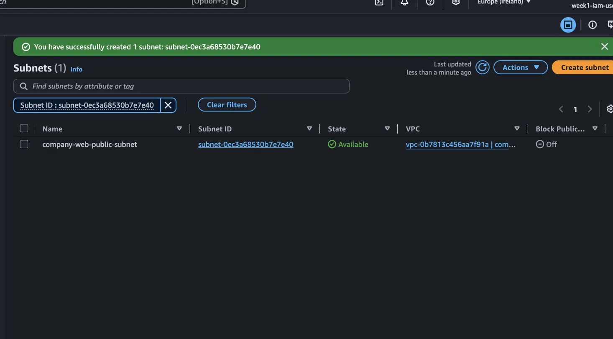
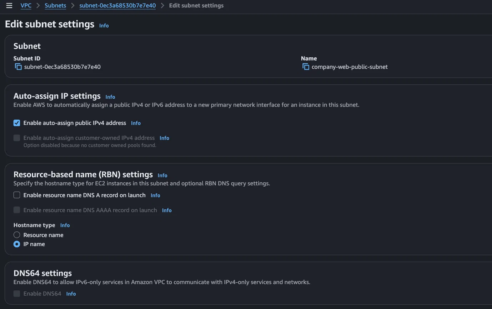

---

## Step 3 — Internet Gateway

**What it is:** The internet gateway is the bridge between the VPC and the public internet. Without it, no traffic can enter or leave the VPC regardless of routing configuration.

**Important:** AWS creates the IGW in a detached state. It must be explicitly attached to the VPC after creation — a step that is easy to miss and will silently break all internet connectivity.

**Configuration:**
- Name: company-web-igw
- Attached to: vpc-0b7813c456aa7f91a (company-web-vpc)
- State: Attached

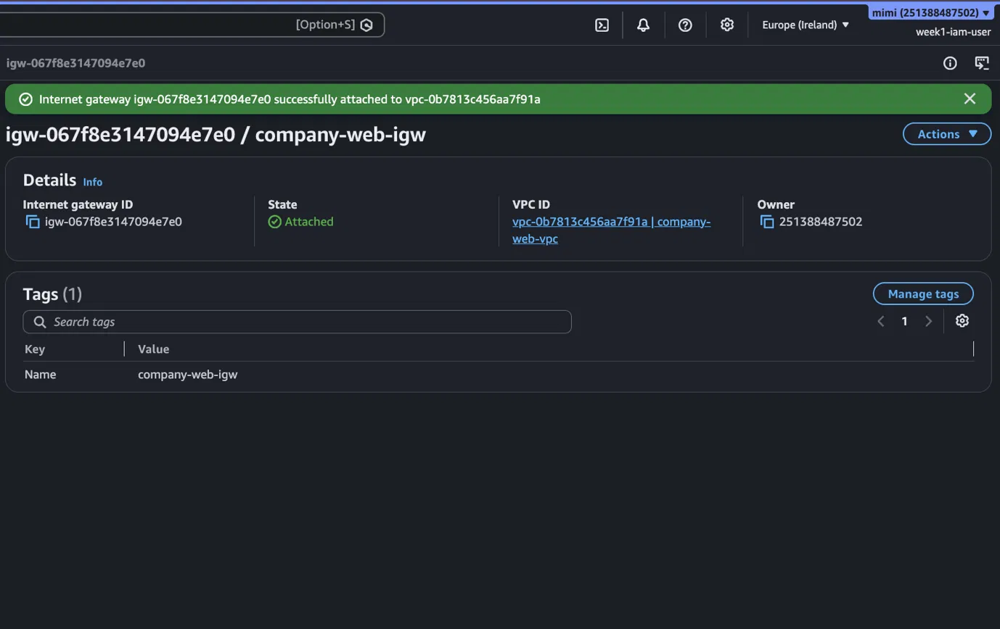

---

## Step 4 — Route Table

**What it is:** A route table contains rules that determine where network traffic is directed. Every subnet must be associated with a route table.

**Why a custom route table:** Rather than editing the VPC's main route table, a new route table was created and explicitly associated with the public subnet. This keeps the main route table as a safe fallback that routes only local VPC traffic, which is best practice.

**Routes configured:**

| Destination | Target | Purpose |
|-------------|--------|---------|
| 10.0.0.0/16 | local | Allows instances within the VPC to communicate with each other |
| 0.0.0.0/0 | igw-067f8e3147094e7e0 | Routes all internet-bound traffic to the IGW |

**Subnet association:** company-web-public-subnet explicitly associated — this is what makes the subnet genuinely public.

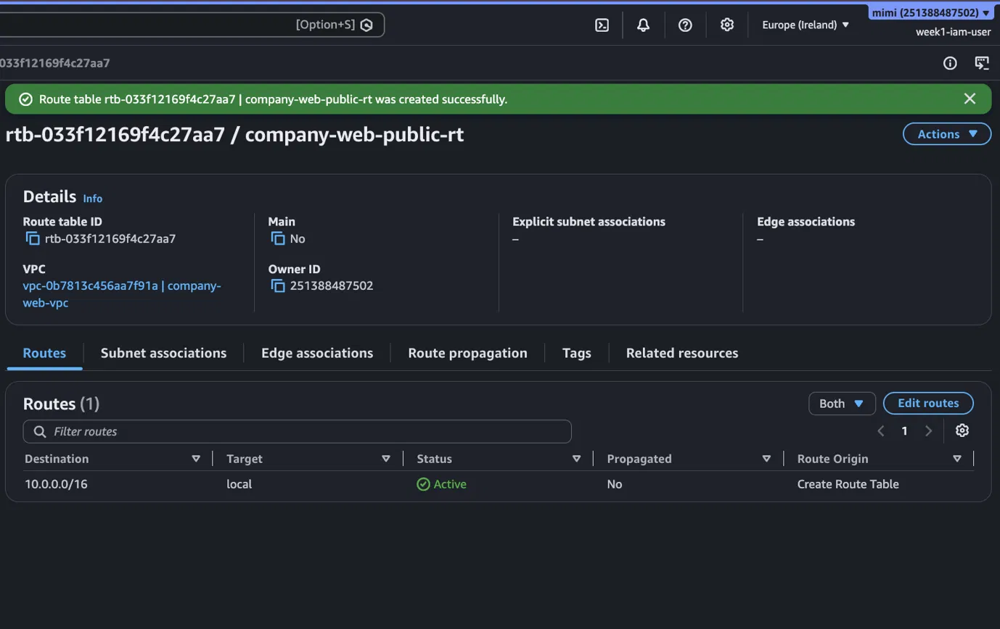
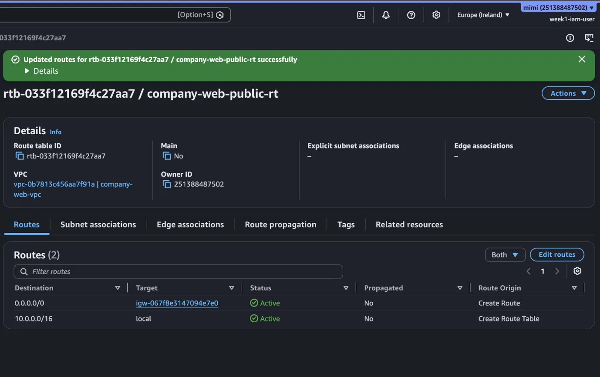
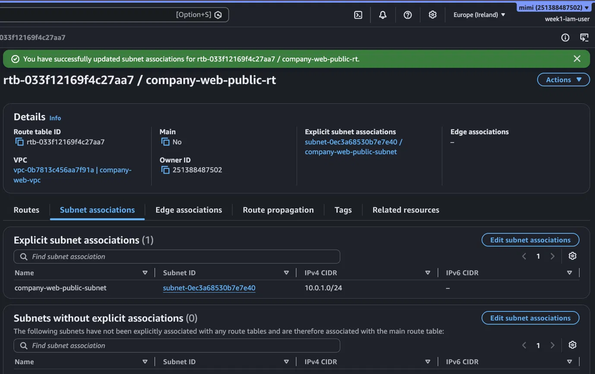

---

## Step 5 — Security Group

**What it is:** A security group acts as a virtual firewall at the instance level, controlling inbound and outbound traffic. Unlike network ACLs which operate at the subnet level, security groups are stateful — return traffic is automatically allowed.

**Inbound rules:**

| Type | Protocol | Port | Source | Reason |
|------|----------|------|--------|--------|
| HTTP | TCP | 80 | 0.0.0.0/0 | Allows anyone to access the website |
| SSH | TCP | 22 | My IP only | Restricts remote access to a single known IP |

**Note on HTTPS:** HTTPS (port 443) was not configured as this project does not include a custom domain or SSL certificate. In a production environment, HTTPS would be enabled via AWS Certificate Manager attached to an Application Load Balancer.

**Outbound rules:** All traffic allowed — required for the instance to download packages and updates during bootstrap.

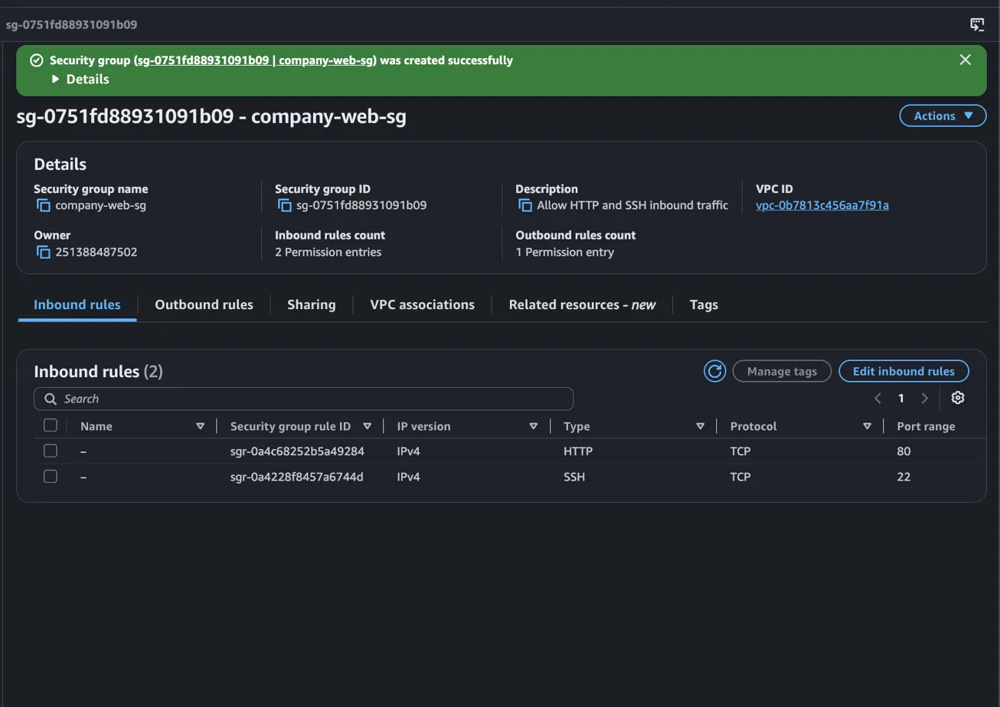

---

## Step 6 — EC2 Instance and Apache

**What it is:** An EC2 (Elastic Compute Cloud) instance is a virtual server in AWS. Apache (httpd) is the web server software that listens on port 80 and serves the HTML page to visitors.

**Configuration:**
- AMI: Amazon Linux 2023
- Instance type: t2.micro (Free Tier eligible)
- Key pair: company-web-key (RSA, .pem)
- VPC: company-web-vpc
- Subnet: company-web-public-subnet
- Auto-assign public IP: Enabled
- Security group: company-web-sg
- Storage: 8 GiB gp3

**Bootstrap script (user-data.sh):**
```bash
#!/bin/bash
yum update -y
yum install -y httpd
systemctl start httpd
systemctl enable httpd
echo "<h1>Hello from $(hostname -f)</h1><p>Deployed on AWS EC2 by Mimi</p>" > /var/www/html/index.html
```

The user data script runs automatically on first boot as root. `systemctl enable httpd` ensures Apache restarts automatically if the instance is rebooted.

**Result:** Website accessible at http://52.212.95.65

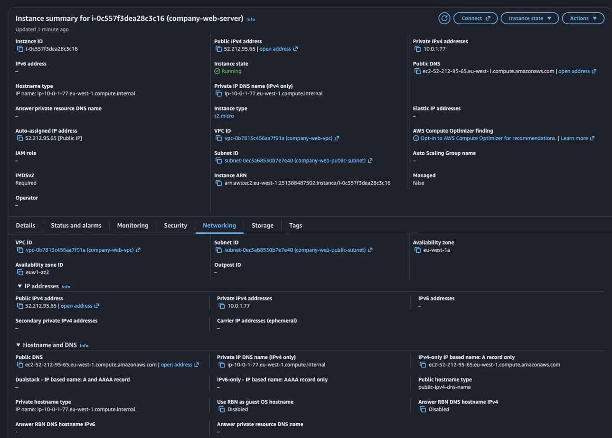
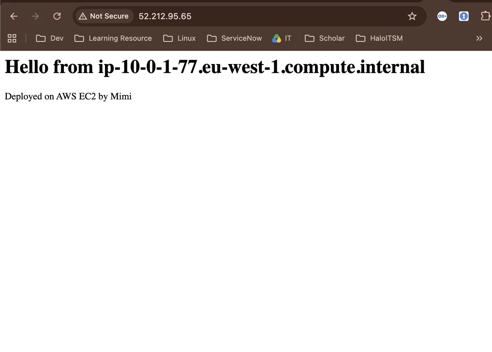

---

## Testing

The website was verified by navigating to `http://52.212.95.65` in a browser immediately after instance launch. The page displayed:

> Hello from ip-10-0-1-77.eu-west-1.compute.internal  
> Deployed on AWS EC2 by Mimi

The private hostname in the response confirms that DNS resolution is functioning correctly inside the VPC, and that the user data script executed successfully on boot.

---

## Architecture Diagram


---

## What I Learned

- How to build a custom VPC from scratch rather than relying on AWS defaults
- The difference between what makes a subnet public: auto-assign public IP handles the instance side; the route table association with an IGW route handles the network side — both are required
- Why DNS hostnames must be explicitly enabled on manually created VPCs
- How security groups work as stateful firewalls at the instance level
- How EC2 user data scripts automate instance configuration at boot time
- Resource teardown order matters: instance → security group → route table → IGW (detach first) → subnet → VPC

---

## Teardown Order

To delete all resources without errors:

1. Terminate EC2 instance — wait for status: terminated
2. Delete security group — company-web-sg
3. Delete route table — company-web-public-rt
4. Detach internet gateway from VPC, then delete it
5. Delete subnet — company-web-public-subnet
6. Delete VPC — company-web-vpc

---

*Project completed as part of Cloud Foundations Virtual Bootcamp — AWS*